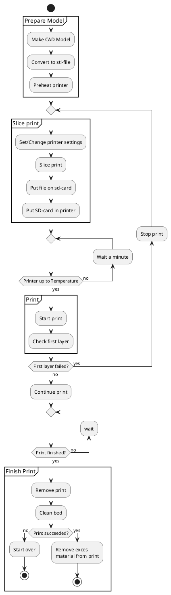

# Chapter 2 - Printing Routine

```plantuml
@startuml
Start
Group Prepare Model
:Make CAD Model;
:Convert to stl-file;
:Preheat printer;
end group
Repeat
backward:Stop print;
group Slice print
:Set/Change printer settings;
:Slice print;
:Put file on sd-card;
:Put SD-card in printer;
end group
Repeat
backward:Wait a minute;
repeat while (Printer up to Temperature) is (no) not (yes)
Group Print
:Start print;
:Check first layer;
End group
Repeat while (First layer failed?) is (yes) not (no)
:Continue print;
Repeat
backward:wait;
repeat while (Print finished?) is (no) not (yes)
Group Finish Print
:Remove print;
:Clean bed;
If (Print succeeded?) then (no)
:Start over;
stop
Else (yes)
:Remove exces\nmaterial from print;
stop
endif
end group
@enduml
```