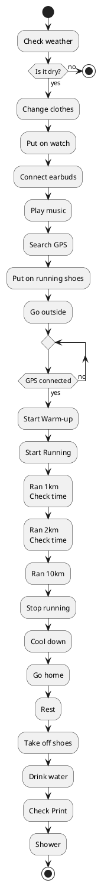

# Chapter 1 - Runnning 

```plantuml
@startuml
start
:Check weather;
if (Is it dry?) then (no)
stop
Else (yes)
endif
:Change clothes;
:Put on watch;
:Connect earbuds;
:Play music;
:Search GPS;
:Put on running shoes;
:Go outside;
repeat
repeat while (GPS connected) is (no) not (yes)
:Start Warm-up;
:Start Running;
:Ran 1km\nCheck time;
:Ran 2km\nCheck time;
:Ran 10km;
:Stop running;
:Cool down;
:Go home;
:Rest;
:Take off shoes;
:Drink water;
:Check Print;
:Shower;


Stop
@enduml
```