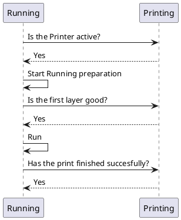

# Communication

```plantuml
@startuml
Running -> Printing : Is the Printer active?
Printing --> Running : Yes
Running -> Running: Start Running preparation
Running -> Printing: Is the first layer good?
Printing --> Running: Yes
Running -> Running: Run
Running -> Printing: Has the print finished succesfully?
Printing --> Running: Yes

@enduml
```